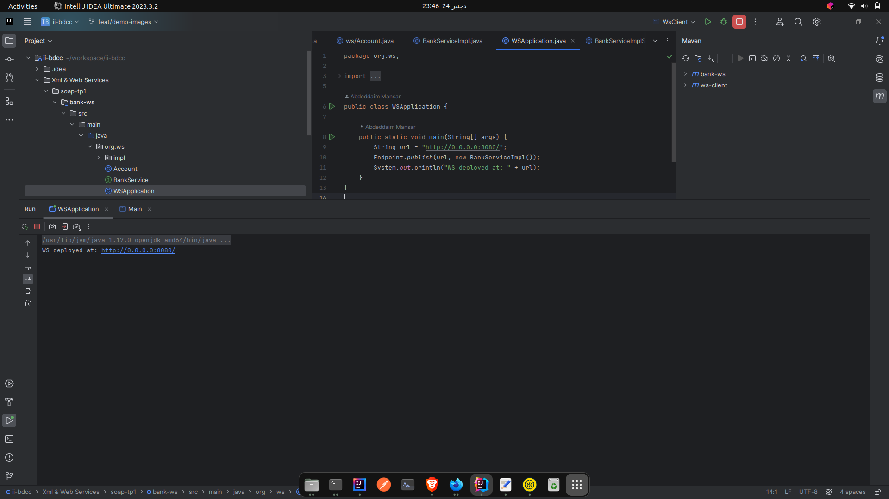
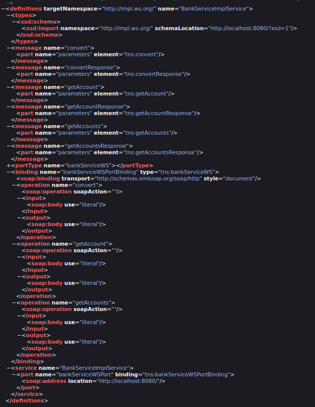
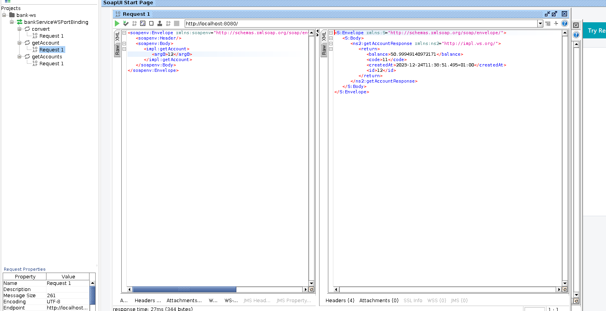
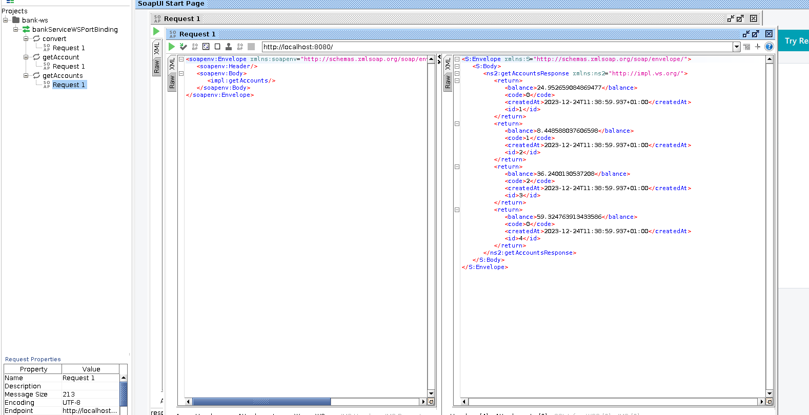
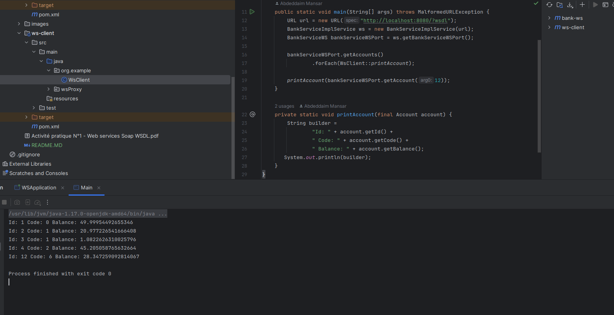

<h1>SOAP Web Service Demo</h1>

<h3> Deploy WS with JaxWs : </h3>

<h3> WSDL : </h3>

<h3> Get an account with SOAP UI : </h3>

<h3> Get All Accounts : </h3>

<h3> Consume WS with java client : </h3>

